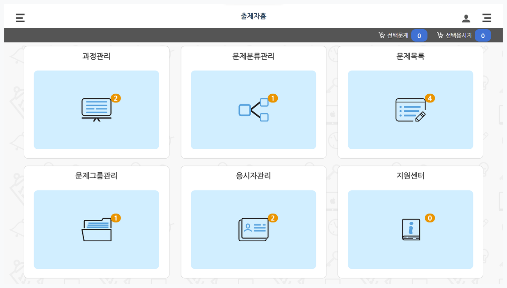

# 출제자 소개

출제자 서비스 이용은 우선 출제자 로그인이 된 이후에 출제자 메뉴에 진행할 수 있습니다. 출제자 로그인은 소이스터디 시험 서비스 홈페이지 (www.soystudy.com)에 접속한 이후에 진행합니다. 출제자는 소이스터디 출제자 회원가입을 통해서 진행할 수 있으며 서비스 사용권한에 따라 **무료(Basic),** **스탠다드(Standard), 프로(Pro), 비즈니스(Business)**로 구분되며 최초 가입시 무료등급으로 등록되어 무상으로 시험을 등록 및 배포를 할 수 있습니다.

출제자 홈의 각각의 메뉴에 대한 설명은 다음과 같습니다.

| 메 뉴    | 설 명                                           |
| ------ | --------------------------------------------- |
| 과정관리   | 과정목록조회, 과정정보조회, 과정 추가/수정/삭제, 과정내 시험세트 후기관리    |
| 문제분류관리 | 문제분류목록조회, 문제분류정보조회, 문제분류 추가/수정/삭제             |
| 문제관리   | 문제목록조회, 문제정보조회, 문제 추가/수정/복사/삭제, 문제 엑셀업로드/다운로드 |
| 문제그룹관리 | 문제그룹목록조회, 문제그룹정보조회, 문제그룹 추가/수정/삭제             |
| 응시자관리  | 응시자목록조회, 응시자정보조회, 응시자 인증메일발송, 응시자 추가/수정/삭제    |
| 지원센터   | 서비스 이용에 관련된 문의 또는 장애발생시 질의응답 게시판 운영           |
| 출제자    | 정보관리 출제자정보조회, 출제자정보수정, 출제기관 로고등록              |
