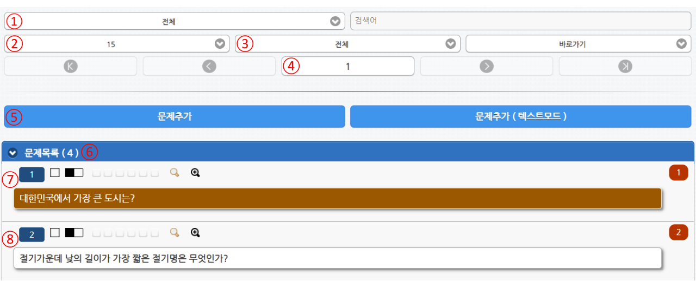

# 문제목록 소개

출제자가 시험응시에 출제할 문제를 관리 하는 페이지 입니다.

출제자 홈 > 문제목록에서 확인 할 수 있으면 화면의 기능들은 아래와 같습니다.

| 번호 | 내용                |
| -- | ----------------- |
| 1  | 문제분류              |
| 2  | 한 페이지에 보여질 문제의 갯수 |
| 3  | 문제의 난이도 조건        |
| 4  | 현재 페이지 번호         |
| 5  | 문제추가 버튼           |
| 6  | 전체 등록된 문제의 갯수     |
| 7  | 선택된 문제            |
| 8  | 선택되지 않은 문제        |
