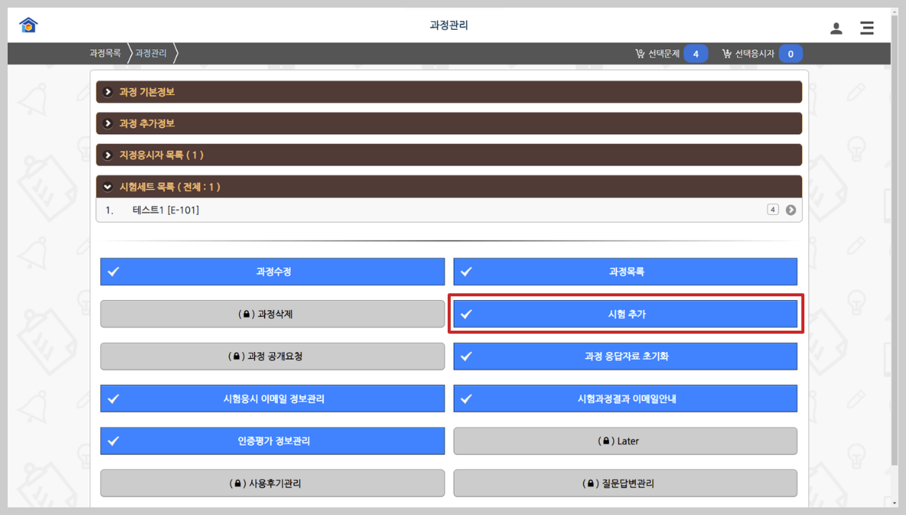

# 시험세트 생성

시험세트를 생성하기 이전에 생성하는 시험세트의 <mark style="color:blue;">공개속성</mark> 등을 확인하여 적정한 과정을 선택할 수 있도록 합니다. 즉, 해당시험에 출제자 회원전체가 응시할지 혹은 출제자가 보유한 출제자 회원가운데 일부를 지정할지에 따라서 <mark style="color:blue;">지정과정</mark> 혹은 <mark style="color:blue;">한정과정</mark>을 선택하여야 합니다. 과정을 잘못 선택하여 시험세트가 생성된 경우에는 생성된 시험세트를 <mark style="color:red;">삭제</mark>하고 다시 등록을 하셔야 합니다. 지정과정에서 시험세트가 생성될 경우에는 선택응시자 목록에 있는 출제자 회원에게 해당 시험세트에 응시할 수 있는 권한을 자동적으로 부여하게 됩니다.

## 1.선택문제목록에서 시험세트 생성

시험세트는 상단 우측의 **문제 선택목록**에서 **시험세트 생성**을 클릭하게 되면 과정을 선택하여 시험세트를 생성 할 수 있습니다.

.png>)

## 2.**과정목록에서 시험세트 생성**

과정을 먼저 선택 후 시험세트 생성도 가능합니다. \
**과정관리 > 신규과정 추가 > 시험 추가** 에서 가능합니다. 이때에 선택문제목록에 문제가 담겨져 있어야 시험이 생성됩니다.

**시험추가** 버튼을 누르게 되면 '<mark style="color:blue;">선택문제</mark>'에 담겨진 문제들을 해당 과정의 문제세트로 추가할 수 있습니다. **시험추가** 화면에서 시험세트명, 별칭 등 시험세트를 설정한 뒤 화면 하단의 \[저장]버튼을 누르면 해당 과정 내에 시험이 생성됩니다.
