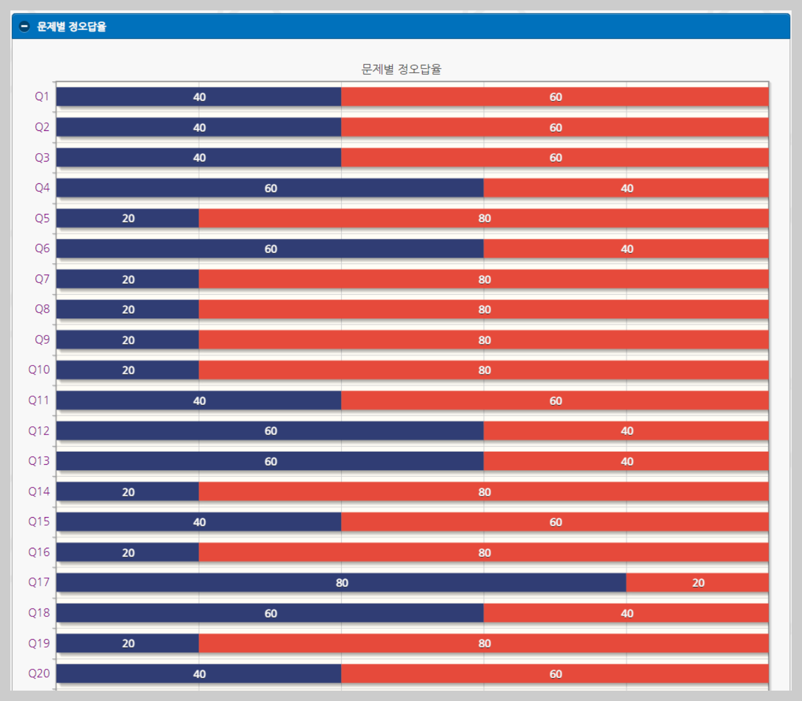

# 시험 후속처리

## 1.**시험 결과 분석**

시험결과분석은 최소 1 명이상의 응시자가 답변을 제출했다면 **시험완료**를 하지 않은 상태에서도 실시간으로 내용을 확인할 수 있습니다. 이에 반해 채점은 **시험완료**가 되지 않은 상태에서는 불가합니다. 시험결과분석에서 분석세부항목을 선택 시에 각각 그래프 혹은 도표가 표기됩니다.

.png>)

점수분포도~~를~~ 통해서 응시자들의 평균점과 주로 위치한 구간을 확인할 수 있으며 이를 통해 응시그룹의 학습성취도 유추, 유사시험의 난이도 조절, 강의콘텐츠의 내용수정 등 다양한 측면에서 활용이 가능합니다. 점수분포도는 응시자가 균등하지 않거나 적을 경우에는 5 분위로 표기가 되며 응시자가 많을 경우에는 10 분위로 표기가 됩니다.&#x20;

> 복모드에서는 응시자가 초기화되더라도 분포자료는 계속 보관됩니다. 하지만 반복응시가 아닌 일반시험모드 즉&#x20;
>
> 문제공개가 설정되지 않은 지정응시과정 시험에 있어서의 시험은 시험세트에서 시험초기화가 되었을 경우에 분석자료 또한 초기화됩니다.

위의 그림에서 파란색은 정답율에 해당하고 붉은색은 오답율에 해당합니다. 모든 문제의 정오답율이 표기가 되어지지만 응시인원이 적은 경우는 큰 의미가 없을 수 있으므로 시험 특성에 따라서 적정한 인원의 응시자가 답변결과를 제출한 이후에 분석결과를 확인하는 것이 좀 더 효과적입니다.

특정문제의 정답율 혹은 오답율이 지나치게 높거나 낮은 경우는 문제별 정오답율 그래프상의 해당 문제를 클릭하여 선택항목별(선택지별) 분석을 진행할 수 있습니다.

## **2.시험완료**&#x20;

시험 완료 및 채점은 시험결과분석과 달리 모든 응시자가 시험 답변을 제출한 상태에서 이루어질 수 있습니다. 다른 측면에서 바라보면 모든 응시자가 정해지지 않은 시험 즉, 외부공개허용시험의 경우는 채점이 불가합니다.&#x20;

채점은 지정 및 한정과정에서만 가능하다는 것을 다시 한 번 명심하도록 하셔야합니다. 채점에 앞서 모든 응시자가 답변을 제출했는지 출제자가 확인하는 과정이 필요합니다. 출제자와 채점자는 틀릴 수 있지만 여기서는 동일하다는 가정하에 출제자로 통일하기로 하겠습니다. 출제자는 시간적, 공간적 제약사항을 추정해서 응시자가 모든 자료를 제출했다는 추론이 성립했을 때 비로서 출제자는 시험완료행위를 하여야 합니다.&#x20;
