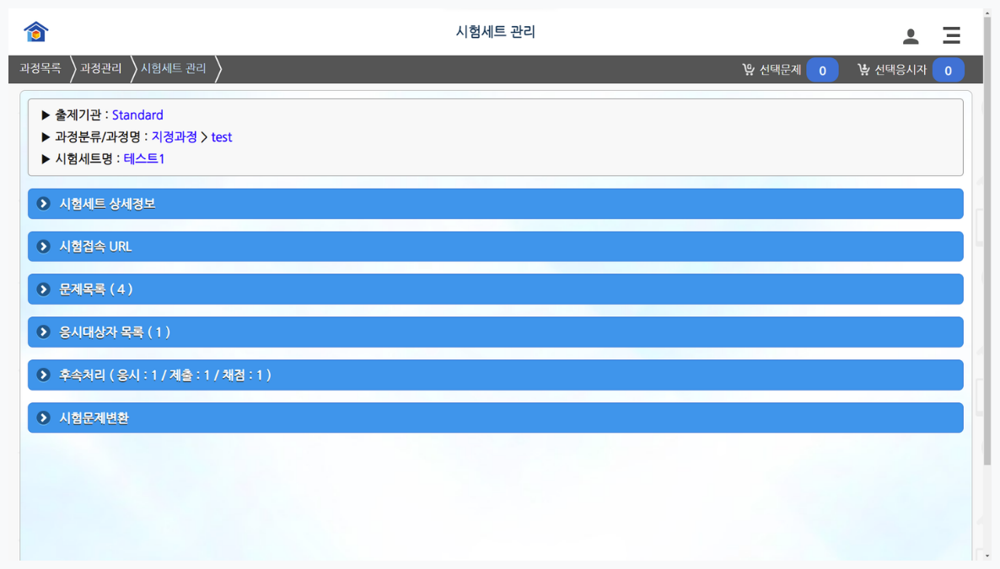

# 시험세트관리 소개

제작한 문제를 시험세트로 만들어 응시자에게 시험을 보거나, 완료된 시험의 결과를 분석할 수 있습니다.

**과정상세정보** 하단의 **시험세트 목록**을 선택해서 **과정시험세트 관리화면**으로 이동합니다.\
(출제자 페이지 > 과정 관리 > 과정 목록 선택 > 과정 시험세트 선택 > 과정 시험세트 관리 )

과정시험세트 관리화면은 크게 다섯가지 서브화면으로 분류됩니다.

| 항 목                  | 설 명                                                                                                                                                                    |
| -------------------- | ---------------------------------------------------------------------------------------------------------------------------------------------------------------------- |
| 
시험세트  상세정보
 | 시험세트의 상세정보를 제공하고 하단의 시험세트 수정, 복사, 그룹설정, 목록편집, 문제순서 변경 등 다양한 버튼을 통해 관리업무수행이 가능합니다. 이때 시험세트가 시험에 실제로 사용될 경우에 일부 기능 사용불가합니다.                                              |
| 문제목록                 | 시험세트에 포함된 전체문제를 목록화하여 제공하며 문제별 속성확인, 문제편집 및 미리보기 가 가능합니다.                                                                                                              |
| 
응시대상자  목록
  | 
응시자지정과정에 속한 경우에 시험세트에 응시할 수 있는 대상자 목록을 나타냅니다. (응시자 지정과정이 아닌 경우 혹은 외부 공개 과정인 경우에는 표기되지 않습니다.)

시험이 진행중일 경우 응시자가 답안을 제출할 때마다 실시간으로 응시자대상자 목록의 응시자 상태가 갱신됩니다.
 |
| 후속처리                 | 
응시자들이 시험을 모두 제출한 이후에 출제자가 진행할 후속행위로서 시험완료, 분석, 채점 및 채점 결과배포가 있습니다. 

※ 시험완료가 이루어지기 전에는 채점 및 결과배포가 불가합니다.
                                                   |
